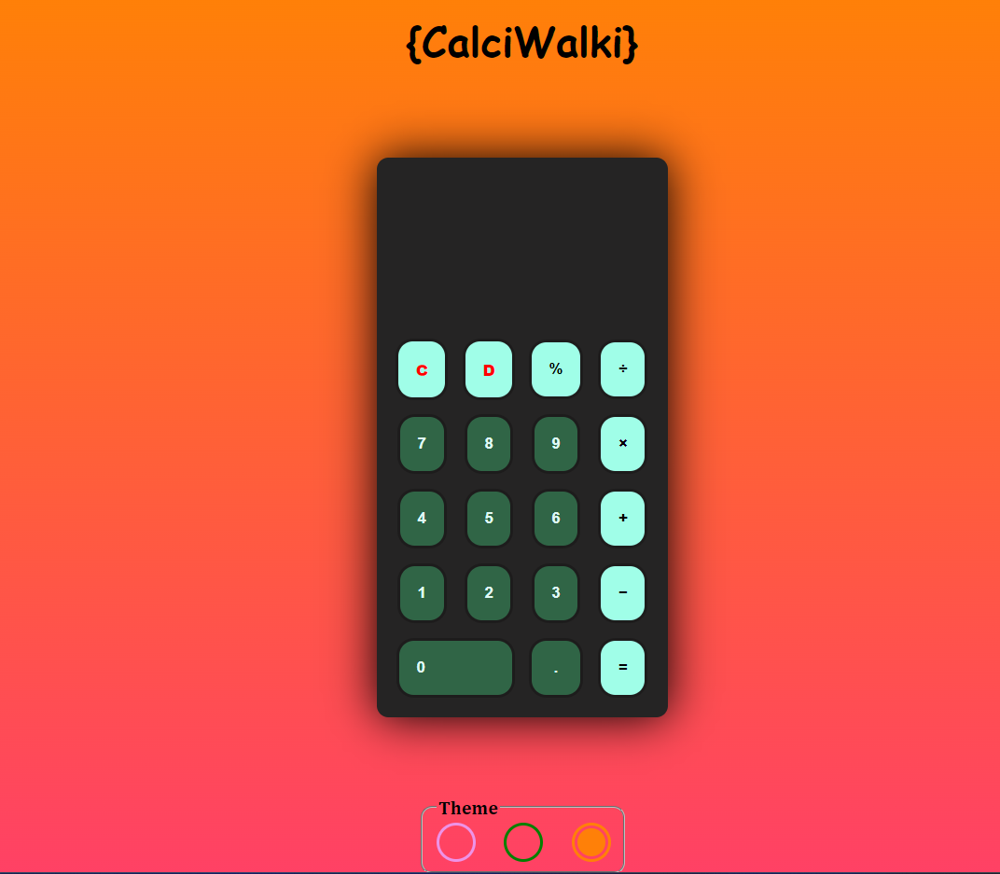
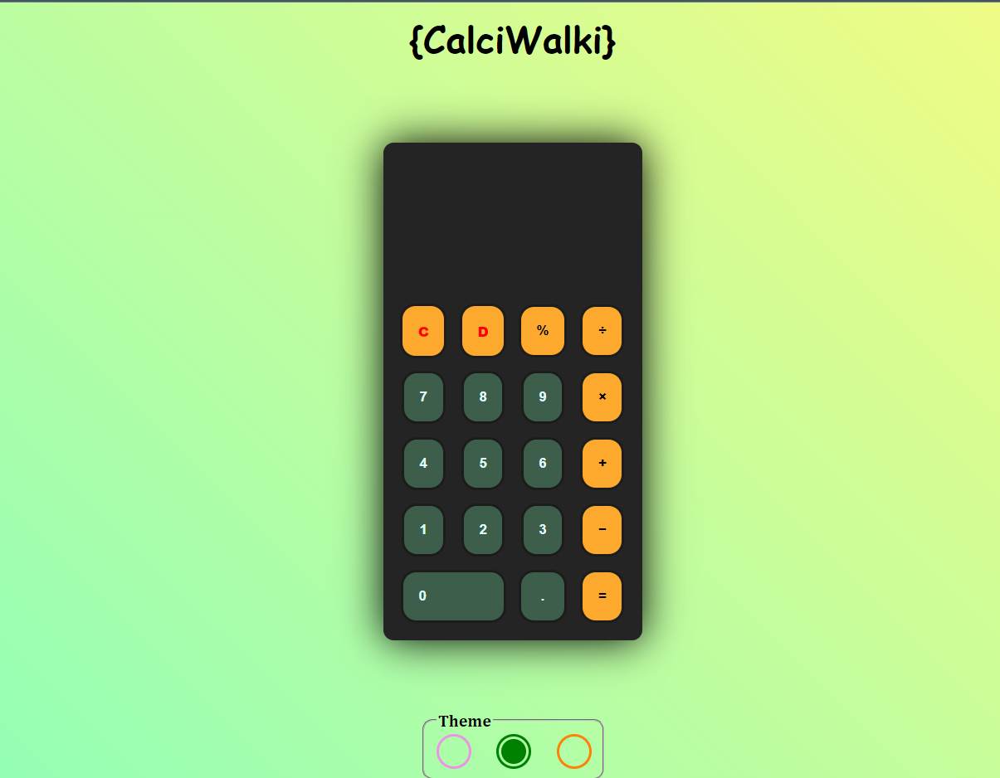
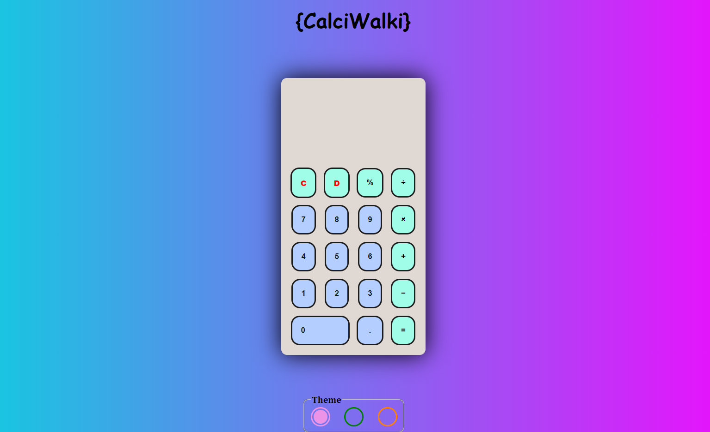

# CalciWalki
# Calculator Website

## Overview
The Calculator Website is a simple and user-friendly online calculator that allows users to perform basic arithmetic calculations and customize the visual theme of the calculator.

## Features
- **Basic Calculations**: Users can perform basic arithmetic operations, including addition, subtraction, multiplication, and division.

- **Responsive Design**: The website is designed to be responsive, ensuring that it works well on a variety of devices, including desktops, tablets, and mobile phones.

- **Theme Customization**: Users can change the visual theme of the calculator to suit their preferences. This includes options for different color schemes and styles.

## Demo
You can check out a live demo of the Calculator Website [here](https://jitmandal051004.github.io/CalciWalki/).

## Screenshots

